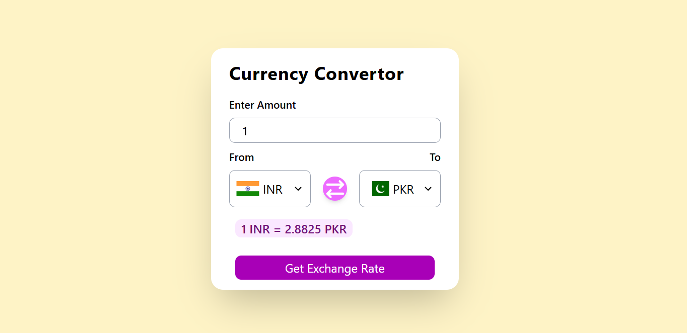

# Currency Converter

A responsive Currency Converter built using **HTML**, **Tailwind CSS**, and **Vanilla JavaScript**. The application fetches real-time exchange rates from a public currency API and allows users to convert between more than 160 international currencies while dynamically updating country flags.

---

## Preview



---

## Features

- Convert between 160+ world currencies
- Fetch real-time exchange rates using a public API
- Automatically update country flags based on the selected currency
- Generate currency dropdown options dynamically
- Responsive user interface built with Tailwind CSS
- Input validation for invalid values
- Error handling for failed API requests

---

## Technologies Used

- HTML5
- Tailwind CSS
- JavaScript (ES6+)
- Fetch API
- Async/Await

---

## Project Structure

```text
Currency-convertor/
│
├── index.html
├── app.js
├── codes.js
├── output.css
└── README.md
```

---

## Getting Started

### Clone the repository

```bash
git clone https://github.com/ajwazameer/Currency-convertor.git
```

### Run the project

Open the `index.html` file in your preferred web browser.

No additional installation or dependencies are required. Unless you have TailwindCss configured.

---

## How It Works

1. Enter the amount to convert.
2. Select the source currency.
3. Select the destination currency.
4. Click **Get Exchange Rate**.
5. The application fetches the latest exchange rate and displays the converted amount.

---

## API

This project uses the free Currency API by Fawaz Ahmed.

https://github.com/fawazahmed0/exchange-api

---

## Concepts Practiced

- DOM Manipulation
- Event Handling
- Dynamic HTML Generation
- Fetch API
- Async/Await
- Working with APIs
- JavaScript Objects
- Error Handling
- Template Literals
- Form Validation
- Responsive Design with Tailwind CSS

---

## Future Improvements

- Add a currency swap feature
- Display exchange rate history
- Add favorite currencies
- Implement dark mode
- Improve error messages
- Add a loading indicator during API requests

---

## Author

**Ajwa Zameer**

GitHub: https://github.com/ajwazameer

---

## License

This project is licensed under the MIT License.
